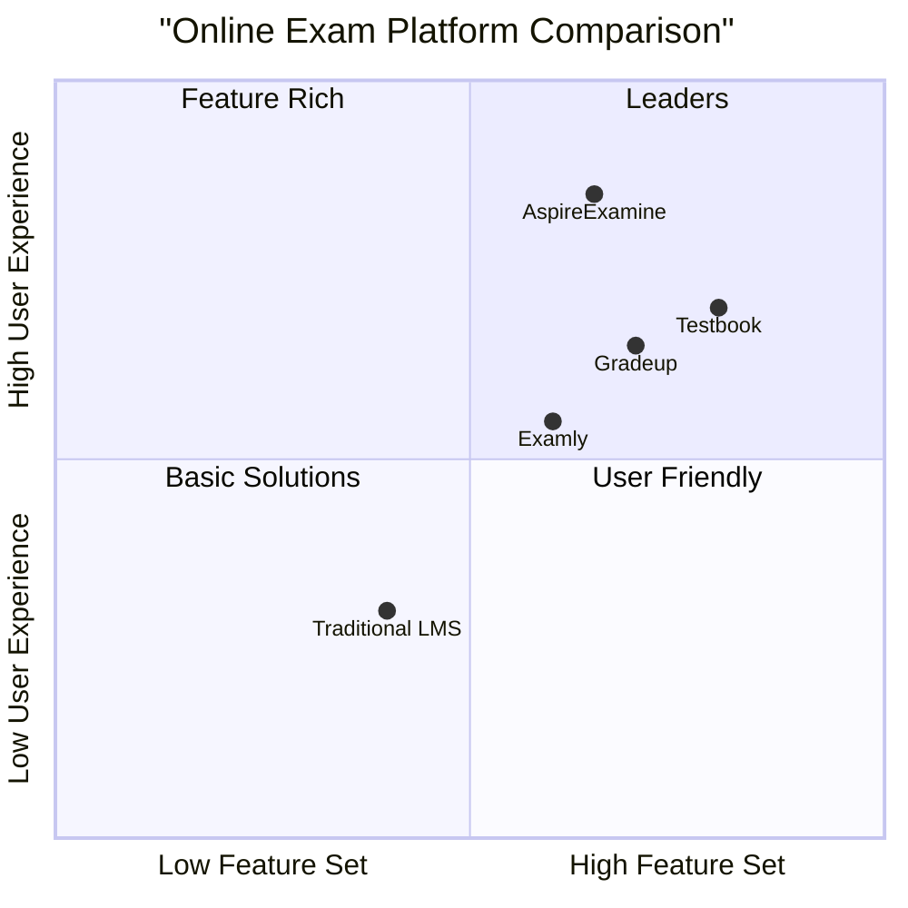

## 3. Competitive Analysis

### 3.1 Competitive Analysis Table

| Feature | AspireExamine | Testbook | Gradeup | Examly |
|---------|--------------|----------|---------|--------|
| No Registration Required | ✅ | ❌ | ❌ | ❌ |
| Real-time Updates | ✅ | ✅ | ❌ | ✅ |
| PDF Reports | ✅ | ✅ | ✅ | ✅ |
| Image Support | ✅ | ✅ | ✅ | ✅ |
| Offline Access | ✅ | ❌ | ❌ | ❌ |
| Session Backup | ✅ | ✅ | ❌ | ❌ |

### 3.2 Competitive Advantages
1. No-registration approach reduces friction
2. Modern tech stack ensures better performance
3. Real-time capabilities enhance user experience
4. Automated PDF generation saves time
5. Session persistence provides reliability

sequenceDiagram
    participant Client
    participant NextServer
    participant Supabase
    participant Storage
    participant PDFWorker

    %% Admin Authentication
    Client->>NextServer: POST /api/admin/login
    NextServer->>Supabase: Verify password
    Supabase-->>NextServer: Auth result
    NextServer-->>Client: Session token

    %% Exam Creation
    Client->>NextServer: POST /api/exams
    NextServer->>Supabase: Insert exam
    Supabase-->>NextServer: Exam data
    NextServer-->>Client: Created exam

    %% Question Upload
    Client->>Storage: Upload image
    Storage-->>Client: Image URL
    Client->>NextServer: POST /api/questions/bulk
    NextServer->>Supabase: Insert questions
    Supabase-->>NextServer: Questions data
    NextServer-->>Client: Created questions

    %% Start Quiz
    Client->>NextServer: GET /api/quiz/:examId/start
    NextServer->>Supabase: Get exam + questions
    Supabase-->>NextServer: Quiz data
    NextServer-->>Client: Quiz initialized
    Client->>Supabase: Subscribe to updates

    %% Answer Submission
    Client->>NextServer: POST /api/quiz/:examId/submit
    NextServer->>Supabase: Save answer
    Supabase-->>Client: Real-time update
    NextServer-->>Client: Submission confirmed

    %% Generate PDF
    Client->>NextServer: GET /api/quiz/:sessionId/result
    NextServer->>PDFWorker: Generate PDF
    PDFWorker->>Supabase: Fetch session data
    Supabase-->>PDFWorker: Complete data
    PDFWorker-->>NextServer: PDF blob
    NextServer-->>Client: PDF download
    
