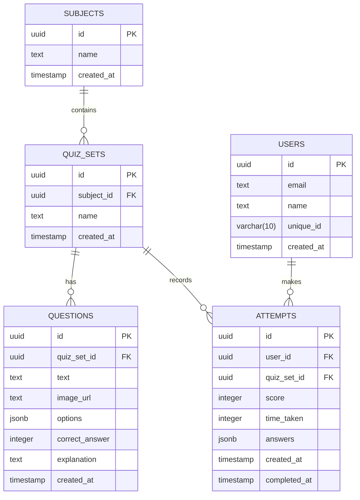
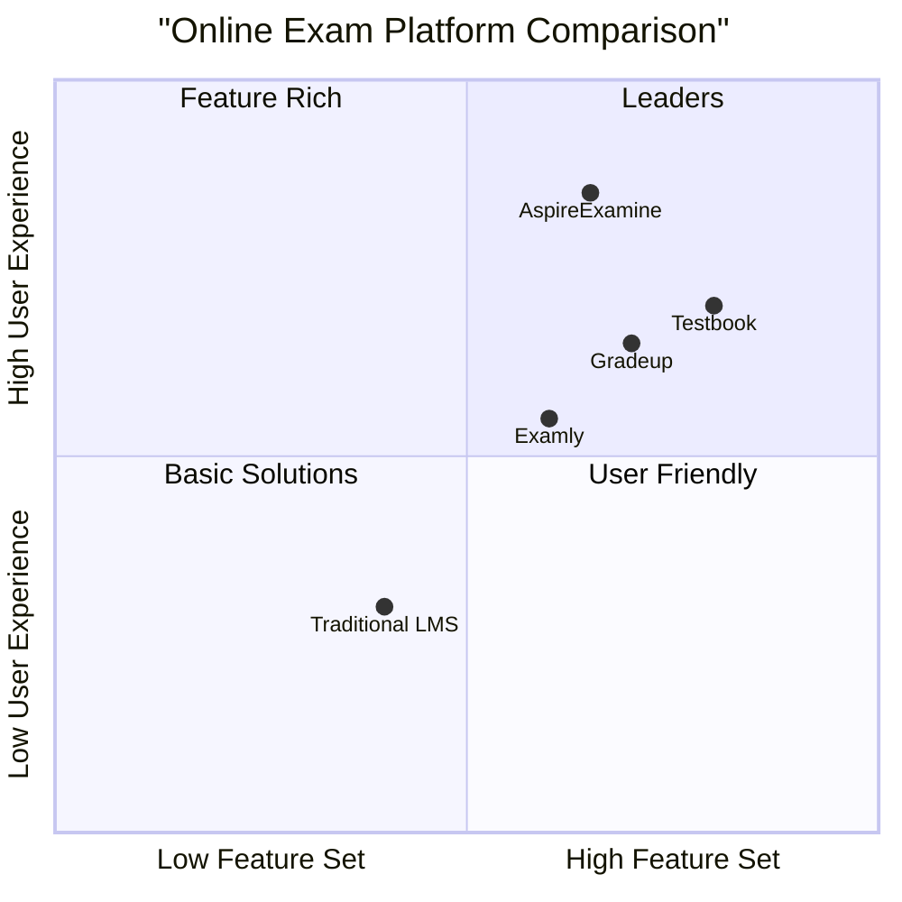

# AspireExamine - Online Examination Platform

A modern, feature-rich online examination platform built with React, TypeScript, and Supabase.


## Features

### For Students
- **No Registration Required**: Take exams instantly as a guest
- **User Profiles**: Create accounts to track progress
- **Real-time Progress**: Live scoring and time tracking
- **Performance Analytics**: Detailed insights into exam performance
- **PDF Reports**: Downloadable exam results
- **Question Navigation**: Easy movement between questions
- **Mark for Review**: Flag questions to review later
- **Auto-submit**: Automatic submission when time expires
- **Mobile Responsive**: Works seamlessly on all devices

### For Administrators
- **Easy Quiz Creation**: Intuitive interface for creating question papers
- **Image Support**: Add images to questions
- **Flexible Options**: Multiple choice questions with explanations
- **Subject Management**: Organize quizzes by subjects
- **Real-time Updates**: Instant quiz availability after creation

## Technology Stack

- **Frontend**
  - React 18
  - TypeScript
  - Tailwind CSS
  - Framer Motion
  - Lucide Icons
  - Zustand (State Management)
  - React Router DOM
  - jsPDF (PDF Generation)

- **Backend & Database**
  - Supabase (PostgreSQL)
  - Row Level Security
  - Real-time Subscriptions

## Database Schema



## Getting Started

### Prerequisites
- Node.js 18+
- npm or yarn
- Supabase account

### Installation

1. Clone the repository
```bash
git clone https://github.com/yourusername/aspireexamine.git
cd aspireexamine
```

2. Install dependencies
```bash
npm install
```

3. Create a `.env` file in the root directory
```env
VITE_SUPABASE_URL=your_supabase_url
VITE_SUPABASE_ANON_KEY=your_supabase_anon_key
```

4. Run database migrations
```bash
npx supabase db push
```

5. Start the development server
```bash
npm run dev
```

### Building for Production

```bash
npm run build
```

The build artifacts will be stored in the `dist/` directory.

## Contributing

1. Fork the repository
2. Create your feature branch (`git checkout -b feature/AmazingFeature`)
3. Commit your changes (`git commit -m 'Add some AmazingFeature'`)
4. Push to the branch (`git push origin feature/AmazingFeature`)
5. Open a Pull Request

## License

This project is licensed under the MIT License - see the [LICENSE](LICENSE) file for details.

## Contact

SAHABAJ ALAM - [@cryptosahabaj](https://twitter.com/cryptosahabaj)

Project Link: [https://github.com/yourusername/aspireexamine](https://github.com/yourusername/aspireexamine)

## Acknowledgments

- [Supabase](https://supabase.io/) for the amazing backend service
- [Tailwind CSS](https://tailwindcss.com/) for the utility-first CSS framework
- [Framer Motion](https://www.framer.com/motion/) for smooth animations
- [Lucide Icons](https://lucide.dev/) for beautiful icons
- [jsPDF](https://github.com/parallax/jsPDF) for PDF generation

## Screenshots

### Home Page


### Quiz Interface


### Dashboard


### Admin Panel


## Competitive Analysis



### Competitive Analysis Table

| Feature | AspireExamine | Testbook | Gradeup | Examly |
|---------|--------------|----------|---------|--------|
| No Registration Required | ✅ | ❌ | ❌ | ❌ |
| Real-time Updates | ✅ | ✅ | ❌ | ✅ |
| PDF Reports | ✅ | ✅ | ✅ | ✅ |
| Image Support | ✅ | ✅ | ✅ | ✅ |
| Session Backup | ✅ | ✅ | ❌ | ❌ |

### Competitive Advantages
1. No-registration approach reduces friction
2. Modern tech stack ensures better performance
3. Real-time capabilities enhance user experience
4. Automated PDF generation saves time
5. Session persistence provides reliability
